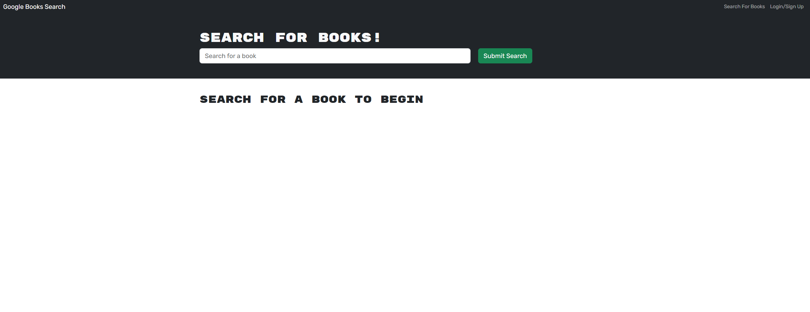

# Book-Search-MERN
A book search engine application using GraphQL and Apollo Server

## Description

A book search application for you to look for books and keep track of ones you like!

- Made for bootcamp challenge 21
- Created for MERN practice

## Table of Contents

- [Installation](#installation)
- [Usage](#usage)
- [Credits](#credits)
- [License](#license)

## Installation

N/A

## Usage

To use this application:

- Click this link to the app: https://book-search-mern-0mni.onrender.com/
- On your first visit, you will see this page:
  
- Use the search box to search for a book, using titles or author names.
- Login or signup with the button at the top right.
- If you are logged in to the website, you can click the blue 'Save this book!' button on any of the search results to add that book to your personal saved books.
- To see your saved books, click on the 'See your books' button at the top right.
- To remove any books from your saved books, just click on the red 'Delete this Book!' button on that book.

## Credits

- Starter code and some boiler plate code from bootcamp week 21 activities.

## License

Please refer to the license in the repo
